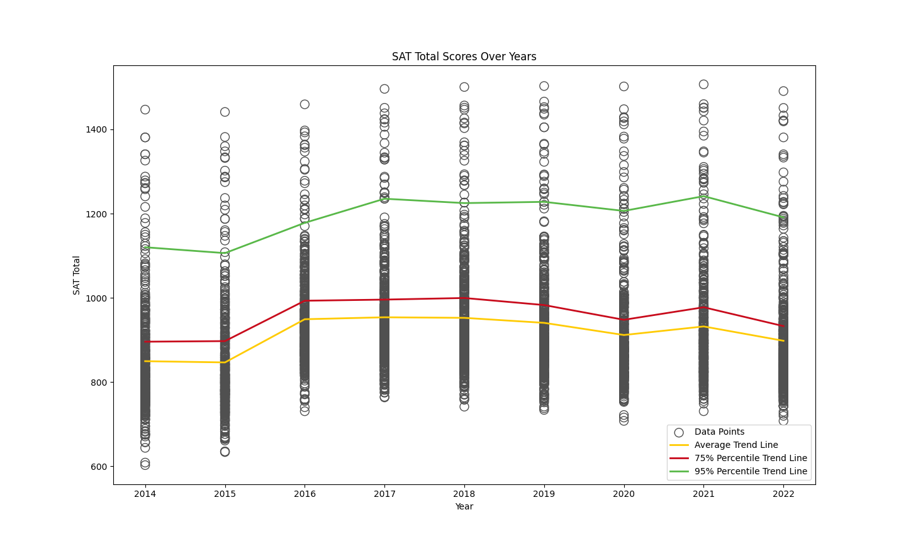
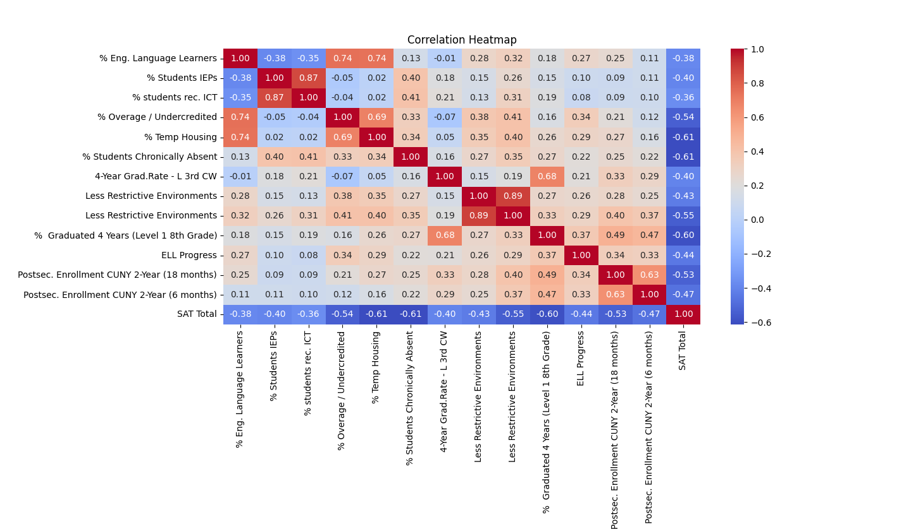
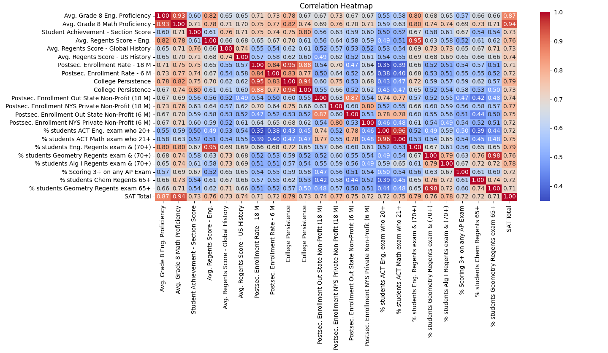
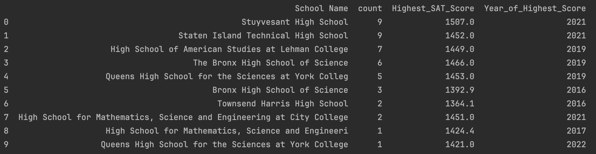

# Data Analysis NYC High School Quality EDA
# Overview
This dataset is sourced from the New York City Department of Education (DOE) and provides valuable insights into the performance of students and the quality of high schools in NYC. The data spans several academic years, from 2014 to 2022, and contains information on various factors such as student achievement, school environment, and additional educational metrics. This dataset allows for in-depth analysis of school performance and can be used to gain insights into trends over time, regional differences, and factors that impact student success.
___
# Data Processing
This repository contains code for processing and cleaning the raw Excel data. It includes functions for:  
Loading Data: Importing data from multiple Excel files (one for each academic year).  
Data Cleaning: Removing unwanted columns, handling missing values, and converting data types for analysis (e.g., converting scores to numeric values).  
Merging Data: Combining various data points (like SAT scores and demographic information) for further analysis.  
Aggregation: Summarizing data for key performance metrics (e.g., average SAT scores, top-performing schools).  
___
# Results
I would like to first mention when doing EDA I realized that the data for what happens to students after graduation(postsecondary) but the data is unusable. I was planning on showing which schools lead to colleges more often, or jobs more often, etc.

Notable Insight:
- 12.1% Increase in 2016 due to restructuring the SAT test  
- From 2016 to 2022 we have dropped 5.39% or 51 points  
- Right-skewed distribution since the 75th Percentile is close to the mean  

Correlations With SAT Totals

Constraint:  
mask = (column_correlations == 1) | (column_correlations < -.3)  
Correlations Less than -.3

Notable Insight:  
- No negative correlations exceed -0.7.
- Postsecondary enrollment in CUNY shows a negative correlation, despite the expectation that higher SAT scores would facilitate admission to CUNY colleges.
- The percentage of students in temporary housing, chronically absent, or performing at Level 1 in 8th grade are the factors most negatively correlated with SAT scores.  

Shortened Phases:
- L 3rd CW (Lowest Third Citywide)
- SETSS (Special Ed Teacher Support Service)
- ICT (Integrated Co-Teaching)
- IEPs (Individualized Education Programs)
- ELL (English-Language Learner)  

Constraint:  
mask = (column_correlations == 1) | (column_correlations > .7)
Correlations Greater than .7
Notable Insight:  
- 8th Grade Math and English scores show the highest correlation with SAT performance.
- College persistence, which measures how well students perform in college after high school, also demonstrates a strong correlation, as expected.
- Surprisingly, the ACT does not exhibit a stronger correlation with the SAT compared to other factors, contrary to expectations.

Top 5 HS Most Reoccuring Schools

# Data Source
___
https://infohub.nyced.org/reports/students-and-schools/school-quality/school-quality-reports-and-resources/school-quality-report-citywide-data

There are the excel files as well in the repository just in case you can't find it on the website.

# Note to self (What I learned)
___
- Loaded muliple files and associated year  
- Converted values of that are strings like numerics into integers  
- Setting up DataFrame where I can call the sheet name, year, columns
- Applied operations & Concatnated the Data  
- Setting Up Graphs
- Removing irrelvant columns
- Method Chaining
- .groupby()
- .apply
- Putting on masks so I can filter through data easier
